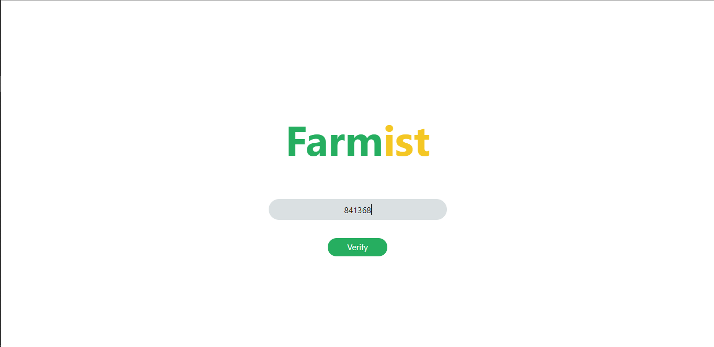
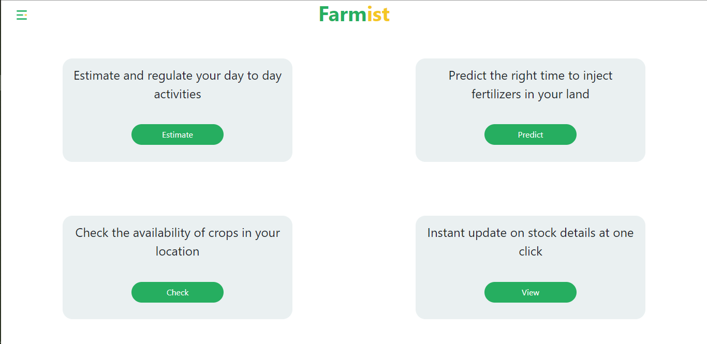
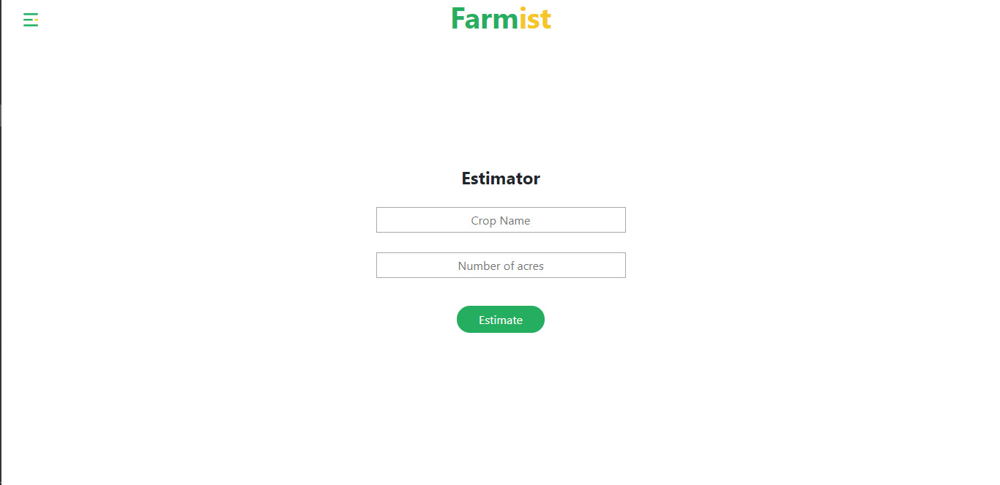
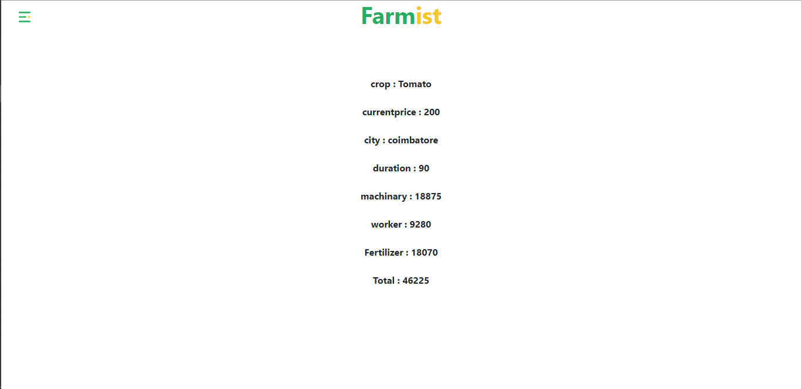

# Farmist
This application is build to assist farmers to predict their investment for managing the crops throughout the lifecycle from cultivating to harvesting the crop.And also suggests right time to inject fertilizers in the land.

## preview
<kbd>
<kbd>
<kbd>
<kbd>
<kbd>
<kbd>
<kbd>